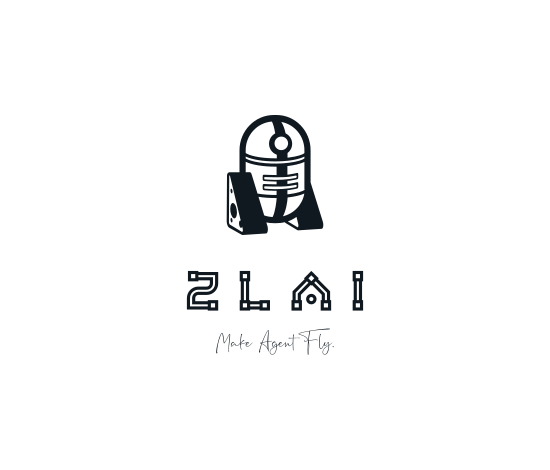

# ZLAI[再来]-Document

<h5>ZLAI Make Agent Fly.</h5>

> Star History

> 简单易学的大模型学习手册

- 丰富的RAG与Agent工具链路
- 面向实践的大模型学习指南

> 开发计划

1. 增加Agent案例应用。
2. 增加图文问答与图文生成。
3. 增加Agent-API集成。

> 讨论群

<h5>微信群</h5>

