# ZLAI

----


[](https://pypi.org/project/zlai/)
[](https://pypi.python.org/pypi/zlai/)
[](https://pypi.org/project/zlai/)
[](https://star-history.com/#zlai-llm/zlai)
[](https://star-history.com/#zlai-llm/zlai)
[](https://zlai-llm.github.io/zlai-doc/)
[](https://github.com/zlai-llm/zlai/issues/new/choose)
[](https://github.com/zlai-llm/zlai/issues/new/choose)
[](https://github.com/zlai-llm/zlai/blob/main/CONTRIBUTING.md)
[](https://github.com/zlai-llm/zlai/blob/main/LICENSE)

<center>

<h5>ZLAI Make Agent Fly.</h5>
</center>

> 这里是ZLAI的项目文档，ZLAI（`再来`）是一个致力于大模型开发的工具箱。

**为什么选择ZLAI?**

- **统一的大模型调用方式**: ZLAI提供了一致的大模型接口，这包含了`ZhipuAI/Ali/Atom/MoonShot/Baichuan/Baidu`等12家机构在内的`100`多种大模型，这意味着您可以为您的任何场景更自由的切换大模型，让大模型调用变得简单和高效。
- **灵活的参数配置**: ZLAI为每一个大模型提供了独立的配置空间，默认情况下配置了大模型官网推荐的参数，如果您不满足于仅仅调用模型接口，ZLAI也支持灵活的参数配置，可以根据需求定制化大模型的任何参数。
- **模板化的消息机制**: ZLAI提供了一套灵活的消息模版与消息召回机制，可以灵活的组织`System/User/Assistant Message`以及`Few-shot`，并且实现了对话过程中的问题与`Few-shot`的动态召回，这让让对话信息更加清晰与准确。
- **灵活的Agent设计**: 可以灵活的设计与调用`Agent`，是ZLAI的设计初衷，ZLAI设计了`TaskSequense(顺序执行)/TaskSwitch(任务转发)/TaskPlan(任务规划)`等标准Agent中间件，您只需要关注自己的业务流程，便可轻松定义自己的Agent工作流。
- **丰富的案例分享**: ZLAI提供了丰富的案例分享，帮助开发者更好地理解和使用大模型，以及相关 Agent 的开发。
- **持续更新**: ZLAI会不断更新和优化，以提供更好的大模型开发体验。

在该文档的介绍中，您将详细了解大模型开发的方方面面，包含理论、实验、案例，相信您在后续的阅读中会有更多的收获。

> 安装

```bash
# [推荐] 安装最新版本ZLAI的所有模块
pip install zlai[all] -U
# [推荐] 最轻量化安装
pip install zlai[tiny] -U
# [推荐] 安装全部大模型API依赖
pip install zlai[api] -U
```

> Star History

[](https://star-history.com/#zlai-llm/zlai&Date)

> 讨论

<center>

<h6>Fig. Wechat-Group</h6>
</center>

*我们有一个微信群，这里可以更方便的沟通有关方面的技术问题。期待您的优秀建议。*

> 接下来，[Quick Start](quick_start)将为您介绍如何快速上手ZLAI。

-----

- [zlai-icon](https://smashinglogo.com/en/)

@2024/04/02
