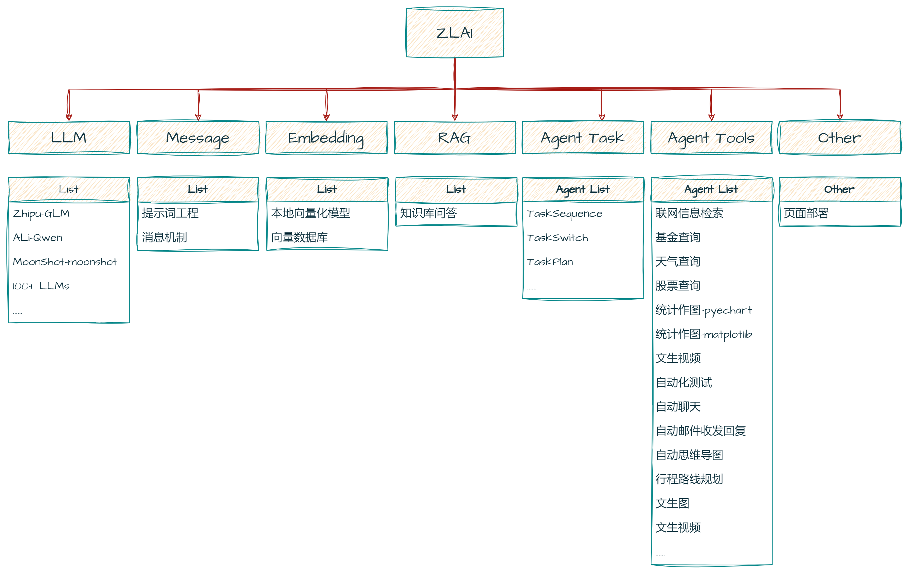

# ZLAI

> This is zlai-package document.

> 在本书的介绍中，您将详细了解大模型开发的方方面面，包含理论、实验、案例，相信您在后续的阅读中会有更多的收获。

<h5>Fig. Project-ZLAI</h5>

-----

<h5>Fig. Wechat-Group</h5>

------

<h3>目录</h3>

**`[总体进度: 30%]`**

| 章节                           | 小节                                                         | 描述 | 备注 |
|------------------------------|------------------------------------------------------------|----|----|
| **LLM**：`[进度: 100%]`         | [线上大模型](llm/zlai-llm-01.md)                                |    |    |
| **LLM**：`[进度: 100%]`         | [大模型调用的便捷方法](llm/zlai-llm-02.md)                           |    |    |
| **LLM**：`[进度: 100%]`         | [本地大模型](llm/zlai-llm-03.md)                                |    |    |
| **LLM**：`[进度: 100%]`         | [大模型参数理论解析](llm/zlai-llm-04.md)                            |    |    |
| **Message**：`[进度: 100%]`     | [message-消息机制](message/zlai-message-01.md)                 |    |    |
| **Prompt**：`[进度: 95%]`       | [大模型的局限性](prompt/zlai-prompt-01.md)                        |    |    |
| **Prompt**：`[进度: 95%]`       | [提示词设计一般思路](prompt/zlai-prompt-02.md)                      |    |    |
| **Prompt**：`[进度: 95%]`       | [大模型参数的设定](prompt/zlai-prompt-03.md)                       |    |    |
| **Prompt**：`[进度: 95%]`       | [Few-shot提示](prompt/zlai-prompt-04.md)                     |    |    |
| **Prompt**：`[进度: 95%]`       | [事实知识提示](prompt/zlai-prompt-05.md)                         |    |    |
| **Prompt**：`[进度: 95%]`       | [思维链](prompt/zlai-prompt-06.md)                            |    |    |
| **Prompt**：`[进度: 95%]`       | [自我一致性](prompt/zlai-prompt-07.md)                          |    |    |
| **Prompt**：`[进度: 95%]`       | [检索增强生成](prompt/zlai-prompt-08.md)                         |    |    |
| **Prompt**-提示词应用：`[进度: 50%]` | [提示词应用](prompt-apply/zlai-prompt-apply-01.md)              |    |    |
| **Prompt**-提示词应用：`[进度: 50%]` | [生成数据](prompt-apply/zlai-prompt-apply-02.md)               |    |    |
| **Prompt**-提示词应用：`[进度: 50%]` | [文本分类](prompt-apply/zlai-prompt-apply-03.md)               |    |    |
| **Prompt**-提示词应用：`[进度: 50%]` | [结构化数据解析](prompt-apply/zlai-prompt-apply-04.md)            |    |    |
| **Prompt**-提示词应用：`[进度: 50%]` | [总结文本摘要](prompt-apply/zlai-prompt-apply-06.md)             |    |    |
| **Prompt**-提示词应用：`[进度: 50%]` | [代码生成](prompt-apply/zlai-prompt-apply-07.md)               |    |    |
| **Prompt**-提示词应用：`[进度: 50%]` | [对话](prompt-apply/zlai-prompt-apply-08.md)                 |    |    |
| **Embedding**：`[进度: 10%]`    | [文本的数字化表示](embedding/zlai-embedding-01.md)                 |    |    |
| **Embedding**：`[进度: 10%]`    | [向量化在大模型中的应用](embedding/zlai-embedding-02.md)              |    |    |
| **Embedding**：`[进度: 10%]`    | [向量数据库简介](embedding/zlai-embedding-03.md)                  |    |    |
| **Embedding**：`[进度: 10%]`    | [elasticsearch](embedding/zlai-elasticsearch.md)           |    |    |
| **Embedding**：`[进度: 10%]`    | [milvus](embedding/milvus.md)                              |    |    |
| **RAG**：`[进度: 10%]`          | [RAG](rag/zlai-rag-01.md)                                  |    |    |
| **Agent**：`[进度: 10%]`        | [Agent](agent/zlai-agent-01.md)                            |    |    |
| **Agent**：`[进度: 10%]`        | [agent](agent/zlai-agent-rag)                               |    |    |
| **Agent**：`[进度: 10%]`        | [agent-tasks-sequence](agent/zlai-agent-03) |    |    |
| **Parse**：`[进度: 10%]`        | [document](parse/zlai-document.md)                         |    |    |
| **Parse**：`[进度: 10%]`        | [parse](parse/zlai-parse-01.md)                            |    |    |

-----
@2024/04/02

