> **ZLAI** 简单易学的大模型学习手册

- 对国内十几家大模型厂商API统一接口，包含100余种中文大模型，任您选用
- 可一键部署`Qwen2/GLM4`等开源大模型，并实现OpenAI API规范的调用
- 支持通用对话、Function Call、多模态、文生图、语音转换TTS等多种调用形式
- 具有丰富的RAG与Agent工具链路指引
- 面向实践的大模型学习指南

[GitHub](https://github.com/zlai-llm/zlai.git)
[Documents](https://github.com/zlai-llm/zlai-doc.git)
[PyPi](https://pypi.org/project/zlai/)
[Get Started](#zlai)
