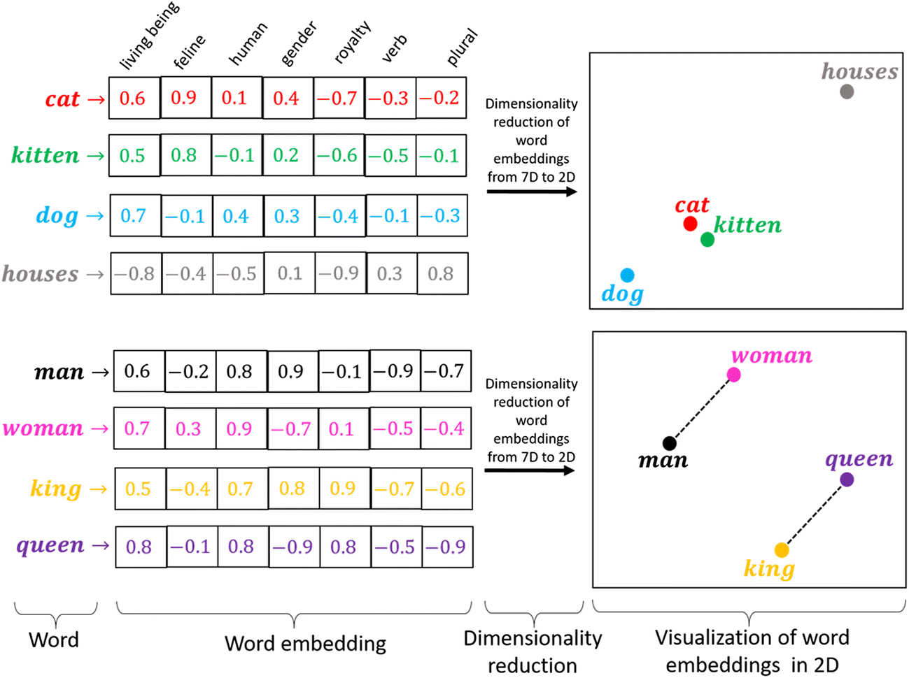

# Embedding

自然语言处理（Natural Language Processing，NLP）是研究使用自然语言的计算机与人类之间的交互。实践中，使用NLP技术来处理和分析文本数据很常见的。原始文本无法被计算机直接处理，要处理这些文本需要从构建词向量表示开始。常用方式有两种，离散表示`one-hot` 和词嵌入向量`word embedding`。

## TF-IDF

TF-IDF（Term Frequency- Inverse Document Frequency）是信息检索中最常用的一种统计学文本表示法。该方法描述了一个特征(字、词、短语)分类能力的好坏。如果特征在某条文本中出现多次，但是在其它文本中很少出现，则说明该特征类别区分能力强；反之，则弱。

该算法包含了两个主要的成分：
- 词频(Term Frequency, TF)，即一个特征在文本中出现的次数；
- 逆文档频率(Inverse Document Frequency, IDF)，即一个特征的类别区分能力，

如果文本集合中含有该特征的文本越少则IDF值越大，同时也说明了该特征有良好的类别区分能力。公式如下：

$$
\begin{aligned} 
TF-IDF&=tf\times idf\\
&=\frac{词i在文档j中的出现次数}{文档总词数}\times \log(\frac{文档总数}{包含词i的文档数}+1)
\end{aligned}
$$

其中：
- `tf`为词频衡量词的出现频率，
- `IDF`为逆文档频率衡量词的常见程度，如果一个词越常见，那么式子中分母就越大。
- `IDF`越小接近于0。此处分母+1处理是为了防止分母为0 (即语料库中不包含该特征)，进而导致计算出的TF-IDF值无穷大的情况

**优缺点：**

* 优点：实现简单快速，结果相对于`onehot`编码俩说更符合实际。
* 缺点：单纯考虑词频，忽略了词与词的位置信息以及词与词之间的相互关系。

## One-hot

one-hot 编码（又称独热编码）是用`N`位状态编码来对N个状态进行编码。每个状态都有它独立的位置，并且在任意时候其中只有一位有效。即每个词表示为一个长向量，向量维度为词表大小，向量中只有一个分量的值为1，其余为0。下面是一个示例：

<h6>onehot</h6>

**优缺点：**
* 优点：解决了自然语言的数字化问题，所有向量都是正交的在高维空间中，很多应用任务线性可分。
* 缺点：没考虑词之间的顺序；计算向量时词与词之间相互独立无法反映词之间的相似性；特征纬度高且稀疏。

## 词嵌入向量

词嵌入向量（`word embedding`）：指的是将词用一个定长连续的稠密向量表示文本。优点是词向量包含更多的信息，并可通过计算词向量之间的余弦距离，反应词之间的相似程度。

近年来，随着预训练技术的发展，利用来自大型语料库并结合自监督学习构建预训练文本表示模型逐渐成熟。例如：通过使用上下文文本预测当前词，模型可以有监督地从海量文本数据中学习，而无需标签标注。通过这些模型的词表示为一个不随上下文变化而变化的向量。

<h6>word2vec</h6>

### cbow 与 skipgram

- `Skip-Gram`假设一个词可以用来在文本序列中生成其周围的单词。
- `CBOW`假设中心词是基于其在文本序列中的周围上下文词生成的。

<h6>cbow & skipgram</h6>

<h6>cbow & skipgram</h6>

> 优缺点

优点：

* word2vec 在计算式考虑到了上下文，进而比传统的词嵌入的效果更好。
* word2vec 的输出是认为指定的一个定长向量，比传统的词嵌入的维度更低使得计算速度更快。

缺点：

* word2vec的词与向量是一一对应的，无法解决一词多义的问题。
* word2vec训练好的词向量是固定的，无法针对特定任务做调整。
