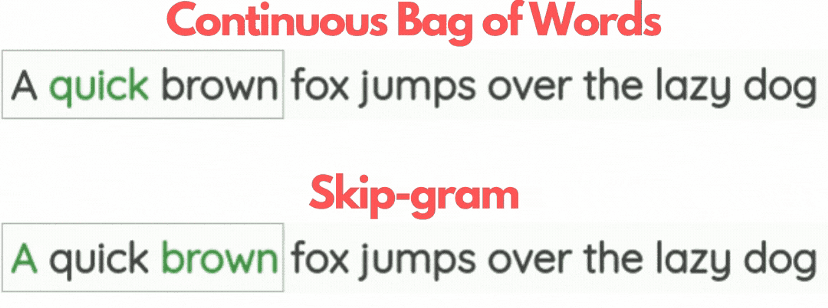

# Embedding

自然语言处理（Natural Language Processing，NLP）是研究使用自然语言的计算机与人类之间的交互。实践中，使用NLP技术来处理和分析文本数据很常见的。原始文本无法被计算机直接处理，要处理这些文本需要从构建词向量表示开始。通常方式：离散表示`one-hot` 和 词嵌入向量`word embedding`。

> one-hot: 该法又称独热编码，指的是将每个词表示为一个长向量。向量维度为词表大小，向量中只有一个分量的值为1，其余为0。优点是在高维空间中，很多应用任务线性可分。 缺点：数据高维、稀疏，所有向量都是正交的无法反映词之间的相似性。

<center>

<h6>onehot</h6>
</center>


one-hot 编码（又称独热编码）是用N位状态寄存器来对N个状态进行编码。
每个状态都有它独立的寄存器位，并且在任意时候，其中只有一位有效。

假设词典中不同词的数量（词典大小）为$N$，每个词对应一个从$0$到$N−1$的不同整数（索引）。
为了得到索引为$i$的任意词的独热向量表示，我们创建了一个全为0的长度为$N$的向量，
并将位置$i$的元素设置为1。
这样，每个词都被表示为一个长度为$N$的向量，可以直接由神经网络使用。

举个例子如图：

| 姓名  |性别|城市|婚姻状况|
|-----| ------| ------| ----------|
| 小张  |男|北京|已婚|
| 小王  |女|上海|已婚|
| 小李  |男|杭州|未婚|

对上述性别、城市、婚姻状况这三个特征进行`one-hot`编码：

* 男→01，女→10
* 北京→001，上海→010，杭州→100
* 已婚→01，未婚→10

||性别|城市|婚姻状况|
| ------| ------| ------| ----------|
|小张|01|001|01|
|小王|10|010|01|
|小李|01|100|10|

最终，小张、小王、小李的向量表示为：

* 小张→0100101
* 小王→1001001
* 小张→0110010

one-hot用于文本特征提取时属于词袋模型（bag of words，bow）。假设语料库中有3句话，如下：

* 我 爱 杭州
* 我 在 汇金 上班
* 浙里信 在 杭州 汇金

利用分词工具将上述语料分词并构建词典：

【1浙里信；2爱；3在；4上班；5杭州；6我；7汇金】，len=7。

使用 one hot 对每段话提取特征向量：

<center>

<h6>One-hot</h6>
</center>

* 我 爱 杭州→0100110
* 我 在 汇金 上班→0011011
* 浙里信 在 杭州 汇金→1010101

**优缺点：**

* 优点：解决了分类器不好处理离散数据的问题；
在一定程度上起到了扩充特征的作用（如上述特征数从3扩增到 2+3+2=7个特征）
* 缺点：由于onehot是一个词袋模型，所没考虑词之间的顺序
（nlp中词序很重要）；计算向量时词与词之间相互独立；特征纬度高且稀疏。


> 词嵌入向量（`word embedding`）：指的是将词用一个定长连续的稠密向量表示。优点是词向量包含更多的信息，并可通过计算词向量之间的余弦距离，反应词之间的相似程度。缺点是无法解决一词多意问题。 

近年来，随着预训练技术的发展，利用来自大型语料库并结合自监督学习构建预训练文本表示模型逐渐成熟。例如：通过使用上下文文本预测当前词，模型可以有监督地从海量文本数据中学习，而无需标签标注。Tranformer出来之前常见的预训练模型有word2vec、GloVe、子词嵌入模型等，通过这些模型的词表示为一个不随上下文变化而变化的向量。

当将每个单词或子词视为单个词元时， 可以在大型语料库上使用word2vec、 GloVe或子词嵌入模型预先训练每个词元的词元。 经过预训练后， 每个词元的表示可以是一个向量。 但是，无论上下文是什么，它都保持不变。 例如，“算账”的词向量表示在 “你别打扰他，他正在算账呢。”（计算账目） 和“好了， 这回算你赢，下回我再跟你算账！”（吃亏或失败后与人较量）中是相同的。 因此，Tranformer出来后许多较新的预训练模型可以根据不同的上下文进行微调， 进而适应不同的上下文。


> one-hot


> TF-IDF（词频-逆文档频率）

TF-IDF （Term Frequency- Inverse Document Frequency）
是信息检索中最常用的一种统计学文本表示法。
该方法描述了一个特征(字、词、短语)分类能力的好坏。
如果特征在某条评论中出现多次，但是在其它评论中很少出现，
则说明该特征类别区分能力强；反之，则弱。

该算法包含了两个主要的成分：
- 词频(Term Frequency, TF)，即一个特征在评论中出现的次数；
- 逆文档频率(Inverse Document Frequency, IDF)，即一个特征的类别区分能力，

如果评论集合中含有该特征的评论越少则IDF值越大，
同时也说明了该特征有良好的类别区分能力。公式如下：

$$
\begin{aligned} 
TF-IDF&=tf\times idf\\
&=\frac{词i在文档j中的出现次数}{文档总词数}\times \log(\frac{文档总数}{包含词i的文档数}+1)
\end{aligned}
$$

其中：
- `tf`为词频衡量词的出现频率，
- `IDF`为逆文档频率衡量词的常见程度，如果一个词越常见，那么式子中分母就越大。
- `IDF`越小接近于0。此处分母+1处理是为了防止分母为0 (即语料库中不包含该特征)，进而导致计算出的TF-IDF值无穷大的情况

**优缺点：**

* 优点：实现简单快速，结果相对于`onehot`编码俩说更符合实际。
* 缺点：单纯考虑词频，忽略了词与词的位置信息以及词与词之间的相互关系。

> 示例

```纯文本
def tf_idf(corpus, vocabulary=None, stop_words=None):
    from sklearn.feature_extraction.text import CountVectorizer  
    from sklearn.feature_extraction.text import TfidfTransformer

    vectorizer = CountVectorizer(vocabulary=None, stop_words=None) # 将文本中的词语转换为词频矩阵  
    corpus_vector = vectorizer.fit_transform(corpus) # 计算词语出现的次数
    print('词表：', vectorizer.get_feature_names_out())
    print('将文本语料转换为向量：\n', corpus_vector.toarray())
    tfidf = TfidfTransformer()  
    tfidf = tfidf.fit_transform(corpus_vector)  # 生成TF-IDF值  
    print('TF-IDF向量：\n', tfidf.toarray())
    return tfidf.toarray()
corpus = ['我 爱 杭州',
          '我 在 汇金 上班',
          '浙里信 在 杭州 汇金']
tf_idf(corpus)
# out:
词表： ['上班' '杭州' '汇金' '浙里信']
将文本语料转换为向量：
 [[0 1 0 0]
 [1 0 1 0]
 [0 1 1 1]]
array([[0.        , 1.        , 0.        , 0.        ],
       [0.79596054, 0.        , 0.60534851, 0.        ],
       [0.        , 0.51785612, 0.51785612, 0.68091856]])
```

## 2. word2vec
词向量是用于表示单词意义的向量，并且还可以被认为是单词的特征向量或表示。 将单词映射到实向量的技术称为词嵌入。 传统的onehot词向量表示有个严重的问题，就是词向量表示之间的余弦相似度为0， 进而导致无法计算词之间的相似性。 为了解决上述问题，2013年底Google开源了基于浅层神经网络的Word2Vec工具， 它是词嵌入模型在工业上的一个有效应用。 它将每个词映射到一个固定长度的向量，这些向量能更好地表达不同词之间的 相似性和类比关系。 Word2Vec在Mikolov等人提出的CBOW和Skip-Gram语言模型的基础上实现的。 CBOW模型基于前馈神经网络语言模型(Neural NetworkLanguage Model, NNLM)实现， 通过连续的上下文内容来预测目标词的概率；而Skip-Gram模型与CBOW模型不同， 它是令当前词作为NNLM输入， 然后预测该当前词之前和之后某个范围内的词，即通过一个词预测上下文的概率。 由于Word2Vec使用的是不带标签的数据， 所以它属于自监督模型。Word2Vec的发布，使用简单的模型结构来训练高质量 的单词向量成为可能。

它将每个词映射到一个固定长度的向量，
这些向量能更好地表达不同词之间的相似性和类比关系。
word2vec主要包含两个模型（`skip-gram`和`CBOW`）。

<center>

<h6>word2vec</h6>
</center>

### 2.1 cbow & skipgram

<center>

<h6>cbow & skipgram</h6>
</center>

<center>

<h6>cbow & skipgram</h6>
</center>

> Skip-Gram

`Skip-Gram`假设一个词可以用来在文本序列中生成其周围的单词。

以文本序列【“我”、“爱”、“杭州”、“西湖”、“风景”】为例。
假设中心词为“杭州”，并将上下文窗口设置为2，
使用Skip-Gram模型生成上下文词“我”、“爱”、“西湖”、“风景”的条件概率：

$$
P(\textrm{"我"},\textrm{"爱"},\textrm{"西湖"},\textrm{"风景"}\mid\textrm{"杭州"})
$$

假设上下文词“我”、“爱”、“西湖”、“风景”是在给定中心词“杭州”的情况下独立生成的（即条件独立性假设）。
则上述条件概率可以重写为：

$$
P(\textrm{"我"}\mid\textrm{"杭州"})\cdot P(\textrm{"爱"}\mid\textrm{"杭州"})\cdot P(\textrm{"西湖"}\mid\textrm{"杭州"})\cdot P(\textrm{"风景"}\mid\textrm{"杭州"})
$$

<center>

<h6>Skip-Gram</h6>
</center>

在Skip-Gram模型中，每个词都有两个$d$维向量表示，用于计算条件概率。
即，对于词典中索引为$i$的任何词，分别用
$\mathbf{v}_i\in\mathbb{R}^d$和$\mathbf{u}_i\in\mathbb{R}^d$
表示其用作*中心词*和*上下文词*时的两个向量。给定中心词$w_c$（词典中的索引$c$），
生成任何上下文词$w_o$（词典中的索引$o$）的条件概率可以通过对向量点积的softmax操作来建模：

$$P(w\_o \mid w\_c) = \frac{\text{exp}(\mathbf{u}\_o^\top \mathbf{v}\_c)}{ \sum\_{i \in \mathcal{V}} \text{exp}(\mathbf{u}\_i^\top \mathbf{v}\_c)},$$

其中词表索引集$\mathcal{V} = \{0, 1, \ldots, |\mathcal{V}|-1\}$。

给定长度为$T$的文本序列，其中时间步$t$处的词表示为$w^{(t)}$。
假设上下文词是在给定任何中心词的情况下独立生成的。
对于上下文窗口$m$，`Skip-Gram`的似然函数是在给定任何中心词的情况下生成所有上下文词的概率：

$$ \prod_{t=1}^{T} \prod_{-m \leq j \leq m,\ j \neq 0} P(w^{(t+j)} \mid w^{(t)}),$$

> Skip-Gram Train

`Skip-Gram`参数是词表中每个词的中心词向量和上下文词向量。
在训练中，我们通过最大化似然函数（即极大似然估计）来学习模型参数。
这相当于最小化以下损失函数：

$$Loss = - \sum_{t=1}^{T} \sum_{-m \leq j \leq m,\ j \neq 0} \text{log}\, P(w^{(t+j)} \mid w^{(t)}).$$

当使用随机梯度下降来最小化损失时，
在每次迭代中可以随机抽样一个较短的子序列来计算该子序列的（随机）梯度，
以更新模型参数。为了计算该（随机）梯度，
我们需要获得对数条件概率关于中心词向量和上下文词向量的梯度。
通常，涉及中心词$w_c$和上下文词$w_o$的对数条件概率为：

$$\log P(w\_o \mid w\_c) =\mathbf{u}\_o^\top \mathbf{v}\_c - \log\left(\sum\_{i \in \mathcal{V}} \text{exp}(\mathbf{u}\_i^\top \mathbf{v}\_c)\right).$$

通过微分，我们可以获得其相对于中心词向量$\mathbf{v}_c$的梯度为

$$
\begin{aligned}
\frac{\partial \text{log}\, P(w\_o \mid w\_c)}{\partial \mathbf{v}\_c}  
&= \mathbf{u}\_o - \frac{\sum\_{j \in \mathcal{V}} \exp(\mathbf{u}\_j^\top \mathbf{v}\_c)\mathbf{u}\_j}{\sum\_{i \in \mathcal{V}} \exp(\mathbf{u}\_i^\top \mathbf{v}\_c)}\\\\
&= \mathbf{u}\_o - \sum\_{j \in \mathcal{V}} \left(\frac{\text{exp}(\mathbf{u}\_j^\top \mathbf{v}\_c)}{ \sum\_{i \in \mathcal{V}} \text{exp}(\mathbf{u}\_i^\top \mathbf{v}\_c)}\right)\mathbf{u}\_j\\\\
&= \mathbf{u}\_o - \sum\_{j \in \mathcal{V}} P(w\_j \mid w\_c) \mathbf{u}\_j.
\end{aligned}
$$

注意，计算需要词典中以$w_c$为中心词的所有词的条件概率。其他词向量的梯度可以以相同的方式获得。

对词典中索引为$i$的词进行训练后，
得到$\mathbf{v}_i$（作为中心词）和$\mathbf{u}_i$（作为上下文词）两个词向量。
在自然语言处理应用中，`Skip-Gram`的中心词向量通常用作词表示。

> CBOW

*连续词袋*（CBOW）模型类似于跳元模型。
它们的主要区别在于，`CBOW`假设中心词是基于其在文本序列中的周围上下文词生成的。

以文本序列【“我”、“爱”、“杭州”、“西湖”、“风景”】为例。
假设中心词为“杭州”，并将上下文窗口设置为2，
使用`CBOW`模型基于上下文词“我”、“爱”、“西湖”、“风景”的生成中心词的条件概率：

$$
P(\textrm{"杭州"}\mid\textrm{"我"},\textrm{"爱"},\textrm{"西湖"},\textrm{"风景"})
$$

<center>

<h6>CBOW</h6>
</center>

由于连续词袋模型中存在多个上下文词，
因此在计算条件概率时对这些上下文词向量进行平均。
具体地说，对于字典中索引$i$的任意词，分别用
$\mathbf{v}\_i\in\mathbb{R}^d$和$\mathbf{u}\_i\in\mathbb{R}^d$
表示用作*上下文*词和*中心*词的两个向量（符号与`Skip-Gram`中相反）。
给定上下文词$w_{o_1}, \ldots, w_{o_{2m}}$
（在词表中索引是$o_1, \ldots, o_{2m}$）
生成任意中心词$w_c$（在词表中索引是$c$）的条件概率可以由以下公式建模:

$$P(w\_c \mid w\_{o_1}, \ldots, w\_{o\_{2m}}) 
= \frac{\text{exp}\left(\frac{1}{2m}\mathbf{u}\_c^\top (\mathbf{v}\_{o_1} 
\+ \ldots, + \mathbf{v}\_{o\_{2m}}) \right)}{ \sum\_{i \in \mathcal{V}} 
\text{exp}\left(\frac{1}{2m}\mathbf{u}\_i^\top (\mathbf{v}\_{o_1} + 
\ldots, + \mathbf{v}\_{o\_{2m}}) \right)}.$$


为了简洁起见，我们设为$\mathcal{W}\_o= \{w\_{o_1}, \ldots, w_{o_{2m}}\}$
和$\bar{\mathbf{v}}\_o = \left(\mathbf{v}\_{o_1} + \ldots, + \mathbf{v}\_{o\_{2m}} \right)/(2m)$。

那么，可以简化为：

$$P(w\_c \mid \mathcal{W}\_o) = \frac{\exp\left(\mathbf{u}\_c^\top 
\bar{\mathbf{v}}\_o\right)}{\sum\_{i \in \mathcal{V}} 
\exp\left(\mathbf{u}_i^\top \bar{\mathbf{v}}_o\right)}.$$

给定长度为$T$的文本序列，其中时间步$t$处的词表示为$w^{(t)}$。
对于上下文窗口$m$，连续词袋模型的似然函数是在给定其上下文词的情况下生成所有中心词的概率：

$$ \prod_{t=1}^{T}  P(w^{(t)} \mid  w^{(t-m)}, \ldots, 
w^{(t-1)}, w^{(t+1)}, \ldots, w^{(t+m)}).$$

> 训练连续词袋模型

训练连续词袋模型与训练跳元模型几乎是一样的。连续词袋模型的最大似然估计等价于最小化以下损失函数：

$$  -\sum_{t=1}^T  \text{log}\, P(w^{(t)} \mid  w^{(t-m)}, \ldots, w^{(t-1)}, w^{(t+1)}, \ldots, w^{(t+m)}).$$

请注意，

$$\log\,P(w\_c \mid \mathcal{W}\_o) 
= \mathbf{u}\_c^\top \bar{\mathbf{v}}\_o - 
\log\,\left(\sum\_{i \in \mathcal{V}} \exp\left(\mathbf{u}\_i^\top 
\bar{\mathbf{v}}\_o\right)\right).$$

通过微分，我们可以获得其关于任意上下文词向量 $\mathbf{v}\_{o\_i}$（$i = 1, \ldots, 2m$）的梯度，如下：

$$\frac{\partial \log\, P(w\_c \mid \mathcal{W}\_o)}{\partial \mathbf{v}\_{o\_i}} 
= \frac{1}{2m} \left(\mathbf{u}\_c - \sum\_{j \in \mathcal{V}} 
\frac{\exp(\mathbf{u}\_j^\top \bar{\mathbf{v}}\_o)\mathbf{u}\_j}{ \sum\_{i \in \mathcal{V}} 
\text{exp}(\mathbf{u}\_i^\top \bar{\mathbf{v}}\_o)} \right) 
= \frac{1}{2m}\left(\mathbf{u}\_c - \sum\_{j \in \mathcal{V}} P(w\_j \mid \mathcal{W}\_o) \mathbf{u}\_j \right).$$

其他词向量的梯度可以以相同的方式获得。与跳元模型不同，连续词袋模型通常使用上下文词向量作为词表示。

> W2V-优缺点

优点：

* word2vec 在计算式考虑到了上下文，进而比传统的词嵌入的效果更好。
* word2vec 的输出是认为指定的一个定长向量，比传统的词嵌入的维度更低使得计算速度更快。

缺点：

* word2vec的词与向量是一一对应的，无法解决一词多义的问题。
* word2vec训练好的词向量是固定的，无法针对特定任务做调整。

## 3. 中文词向量

- [Chinese Word Vectors 中文词向量](https://github.com/Embedding/Chinese-Word-Vectors)

### 3.1 中文词向量

根据不同类型的上下文为每个语料训练多个目标词向量，第二列开始表示不同类型的上下文。以下为上下文类别：

* Word表示训练时目标词预测的上下文是一个Word。
* Word + N-gram表示训练时目标词预测的上下文是一个Word或者Ngram，其中bigram表示2-grams，ngram.1-2表示1-gram或者2-grams。
* Word + Character表示训练时目标词预测的上下文是一个Word或者Character，其中word-character.char1-2表示上下文是1个或2个Character。
* Word + Character + Ngram表示训练时目标词预测的上下文是一个Word、Character或者Ngram。bigram-char表示上下文是2-grams或者1个Character。


特别地，对于百度百科语料，在不同的 Co-occurrence类型下分别提供了目标词与上下文向量：


### 3.2 英文词向量

> Word2Vec

| 语料 | 名称 |
|------|------|
| Google News | w2v.google_news.target.word-word.dim300.en |

> GloVe

| 语料                | 25维     | 50维      | 100维    | 200维    | 300 维   |
| -----------------   | ------   |  ------   | ------   | ------   | ------   |
| Wiki2014 + GigaWord | 无 | glove.wiki2014-gigaword.target.word-word.dim50.en | glove.wiki2014-gigaword.target.word-word.dim100.en | glove.wiki2014-gigaword.target.word-word.dim200.en | glove.wiki2014-gigaword.target.word-word.dim300.en |
| Twitter             | glove.twitter.target.word-word.dim25.en | glove.twitter.target.word-word.dim50.en | glove.twitter.target.word-word.dim100.en | glove.twitter.target.word-word.dim200.en | 无 |

> FastText

| 语料 | 名称 |
|------|------|
| Wiki2017 | fasttext.wiki-news.target.word-word.dim300.en |
| Crawl    | fasttext.crawl.target.word-word.dim300.en |

### 3.3 使用方式

以上所述的模型名称可直接以参数形式传入
`padddlenlp.embeddings.TokenEmbedding`，
加载相对应的模型。比如要加载语料为Wiki2017，
通过FastText训练的预训练模型
（`fasttext.wiki-news.target.word-word.dim300.en`），只需执行以下代码：

```python
from paddlenlp.embeddings import TokenEmbedding

token_embedding = TokenEmbedding(embedding_name="fasttext.wiki-news.target.word-word.dim300.en")
```

> TokenEmbedding

```python
import paddle
from paddlenlp.embeddings import TokenEmbedding, list_embedding_name

# 查看预训练embedding名称：
print(list_embedding_name()) 

# 初始化TokenEmbedding， 预训练embedding没下载时会自动下载并加载数据
token_embedding = TokenEmbedding(
    embedding_name="w2v.baidu_encyclopedia.target.word-word.dim300")

# 查看token_embedding详情
print(token_embedding)
```

> TokenEmbedding.search

```python
# 查询embedding结果
test_token_embedding = token_embedding.search("中国")
```

> TokenEmbedding.cosine_sim

```python
# 计算词向量cosine相似度
score = token_embedding.cosine_sim("中国", "美国")
print(score) # 0.49586025
```

> TokenEmbedding.dot

```python
# 计算词向量内积
score = token_embedding.dot("中国", "美国")
print(score) # 8.611071
```

> 切词

```python
from paddlenlp.data import JiebaTokenizer
tokenizer = JiebaTokenizer(vocab=token_embedding.vocab)
words = tokenizer.cut("中国人民")
print(words) # ['中国人', '民']

tokens = tokenizer.encode("中国人民")
print(tokens) # [12530, 1334]
```

### 3.4 模型信息
