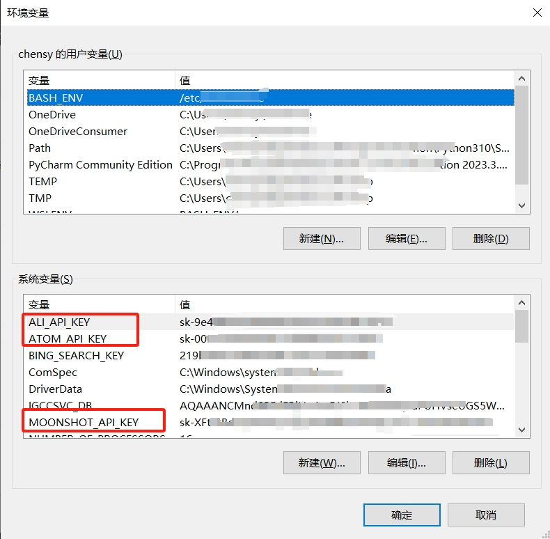

# 在线大模型的简单调用

> 本节介绍`zlai`中大模型的调研方式。

目前，`zlai`支持多种在线大模型的调研，包括`ZhipuAI`、`Ali`、`Atom`、`MoonShot`、`Baichuan（待发版）`、`Baidu（待发版）`等。在`zlai`中你只需定义`模型类`与`模型配置类`两个实例即可完成模型的调用，不同的平台上的大模型我们都使用了相同的调用输出规范。

本章节介绍大模型的API调用方式，并提供一些示例代码。包括了本地部署的模型API调用方式，以及使用大模型API的示例代码。

`ZLAI`统一封装了各类平台的配置类与API调用方式，用户可以方便地调用大模型API。只需要指定好你需要的模型类与配置类，即可快速调用大模型API。

## API KEY

在调用在线大模型时，您需要申请相关平台的`API KEY`，并将其配置到`环境变量`中。以下是各个平台`API KEY`的申请地址与`zlai`中对应的环境变量标准名称：

| 平台                    | 文档地址                                    | API-Key         | 环境变量名称           |
|-----------------------|-----------------------------------------|-----------------|------------------|
| 智谱AI（付费）              | [doc](https://open.bigmodel.cn/dev/api) | 参考官网API-Key申请方式 | ZHIPU_API_KEY    |
| 阿里（付费）                | [doc](https://dashscope.aliyun.com/)    | 参考官网API-Key申请方式 | ALI_API_KEY      |
| 月之暗面（付费）              | [doc](https://platform.moonshot.cn)     | 参考官网API-Key申请方式 | MOONSHOT_API_KEY |
| Atom（暂时免费-2024/04/26） | [doc](https://llama.family/docs/api)    | 参考官网API-Key申请方式 | ATOM_API_KEY     |

> 环境变量的配置方式

<center>

</center>

以下是一些大模型调用示例。

## ZhipuAI

> **模型方法**: `Zhipu`用于调用智谱AI的模型。

```python
from zlai.llms import Zhipu
```

**参数说明**

- `api_key`: 给定已经申请好的`API KEY`，默认为`None`，您也可以在环境变量中配置`ZHIPU_API_KEY`，对于已经配置好环境变量的情况下，可以不填写该参数。
- `generate_config`: 用于给定大模型生成内容时的参数配置，默认为`None`，后面会着重介绍这个参数，一般情况下只需要指定这一个参数就可以进行模型推理了。相关参数的理论介绍[参考](/doc/zlai-llm-04.md)。
- `output`: 指定输出信息的格式，枚举值 `["completion", "message", "str"]`。
    - `completion`: 按照在线API官方模式输出完整的返回信息。
    - `message`: 只输出`Message`信息，`role='Assistant' content='模型回答的内容...'`。
    - `str`: 只输出模型回答的文本信息。
- `verbose`: 是否展示模型的推理调用过程，默认为`False`。
- `api_key_name`: 默认为`ZHIPU_API_KEY`，你也可以指定其他的名称，前提是需要在环境变量中配置该名称与相应的变量值。
- `async_max_request_time`: 异步调用情况下的最大请求时间，默认为`600`s。

> **模型配置**

- `ZhipuGLM3Turbo`: 模型`glm-3-turbo`的默认参数类
- `ZhipuGLM4`: 模型`glm-4`的默认参数类

```python
# 导入智谱大模型配置类
from zlai.llms import (
    ZhipuGLM3Turbo, ZhipuGLM4
)
```

**默认参数**

- `do_sample: Optional[bool]`: `do_sample` 为 `True` 时启用采样策略，`do_sample` 为 `False` 时采样策略 `temperature`、`top_p` 将不生效。
- `stream: Optional[bool]`: 此参数应当设置为 `Fasle` 或者省略。表示模型生成完所有内容后一次性返回所有内容。如果设置为 `True`，模型将通过标准 `Event Stream`，逐块返回模型生成内容。
- `temperature: Optional[float]`: 采样温度，控制输出的随机性，必须为正数取值范围是`(0.0, 1.0)`，不能等于 `0`，默认值为 `0.95`，值越大会使输出更随机，更具创造性；值越小输出会更加稳定或确定建议您根据应用场景调整 `top_p` 或 `temperature` 参数，但不要同时调整两个参数。
- `top_p: Optional[float]`: 用温度取样的另一种方法，称为核取样取值范围是 `(0.0, 1.0)` 开区间，不能等于 `0` 或 `1`，默认值为 `0.7` 模型考虑具有 `top_p` 概率质量 `tokens` 的结果。
- `max_tokens: Optional[int]`: 模型输出最大 `tokens`，最大输出为 `8192`，默认值为 `1024`

**完整调用示例**

```python
from zlai.llms import Zhipu, ZhipuGLM3Turbo, ZhipuGLM4

# 创建模型推理配置
generate_config = ZhipuGLM3Turbo(
    max_tokens=1500,               # 用于指定模型在生成内容时token的最大数量
    top_p=0.8,                     # 生成过程中核采样方法概率阈值
    temperature=0.85,              # 用于控制随机性和多样性的程度
)

# 创建大模型
llm = Zhipu(generate_config=generate_config)

# 如果您只需要使用默认的参数配置，可以直接使用以下方式创建模型
# llm = Zhipu(generate_config=ZhipuGLM3Turbo())
# llm = Zhipu(generate_config=ZhipuGLM4())
# query 为你需要问大模型的问题
completion = llm.generate(query="你好")

print(completion.choices[0].message.content)
```

**返回信息**

```text
>>> 你好👋！我是人工智能助手智谱清言（ChatGLM），很高兴见到你，欢迎问我任何问题。
```

*PS: 模型输出结构*

这里仅以智谱AI的输出结构作为示例，其他平台的大模型输出结构均与智谱AI的输出结构相似，如果有其他较大的差异点会在后续的介绍中进行单独表述。

```json
{
  "created": 1703487403,
  "id": "8239375684858666781",
  "model": "glm-4",
  "request_id": "8239375684858666781",
  "choices": [
      {
          "finish_reason": "stop",
          "index": 0,
          "message": {
              "content": "智绘蓝图，AI驱动 —— 智谱AI，让每一刻创新成为可能。",
              "role": "assistant"
          }
      }
  ],
  "usage": {
      "completion_tokens": 217,
      "prompt_tokens": 31,
      "total_tokens": 248
  }
}
```

模型会以`completion`对象的形式输出，我们需要关注`completion`对象的以下字段：

| 名称                        | 描述                                                                                        |
|---------------------------|-------------------------------------------------------------------------------------------|
| `model`                   | 模型名称                                                                                      |
| `choices`                 | 模型推理输出的结果，有一些模型可以根据随机采样的方式输出多个结果供选择，但目前大部分平台一般只输出一个结果，所以一般情况下`choices`是`List[Dict]`的数据形式。 |
| `choices/finish_reason`   | 模型推理结束的原因                                                                                 |
| `choices/message`         | 模型推理返回的消息                                                                                 |
| `choices/message/role`    | 模型推理返回的角色名称                                                                               |
| `choices/message/content` | 模型推理返回的消息内容                                                                               |
| `usage`                   | 记录了`token`的使用情况                                                                           |

> 模型价格

| 模型名称          | 配置类                | 备注               |
|---------------|--------------------|------------------|
| `glm-4`       | `ZhipuGLM4()`      | 0.1元 / 千tokens   |
| `glm-3-turbo` | `ZhipuGLM3Turbo()` | 0.005元 / 千tokens |

## Ali

> **模型方法**: `Ali`用于调用阿里的线上模型。
 
您可以在[官网](https://dashscope.aliyun.com/)上申请`API KEY`，并将其配置到`环境变量`中，也可以在官网上查看最新的文档信息。

```python
from zlai.llms import Ali
```

**参数说明**: 参考`ZhipuAI`的参数说明。

> **模型配置**

`zlai`封装了几乎所有阿里的线上大模型，您只需要指定一个模型配置类即可完成模型的调用配置生成。相关参数的配置可以参考上文`Zhipu`部分，你也可以参考[官网的文档](https://help.aliyun.com/zh/dashscope/developer-reference/model-square/)。

- `AliQwenTurboGenerateConfig`
- `AliQwenPlusGenerateConfig`
- `AliQwenMaxGenerateConfig`
- `AliQwenMax1201GenerateConfig`
- `AliQwenMaxLongContextGenerateConfig`
- `AliQwen15Chat72BGenerateConfig`
- `AliQwen15Chat14BGenerateConfig`
- `AliQwen15Chat7BGenerateConfig`
- `AliQwenChat72BGenerateConfig`
- `AliQwenChat14BGenerateConfig`
- `AliQwenChat7BGenerateConfig`
- `AliQwenChat18BGenerateConfig`
- `AliQwenChat18BLongContextGenerateConfig`

```python
# 导入阿里大模型配置类
from zlai.llms import (
    AliQwenTurboGenerateConfig,
    AliQwenPlusGenerateConfig,
    AliQwenMaxGenerateConfig,
    AliQwenMax1201GenerateConfig,
    AliQwenMaxLongContextGenerateConfig,
    AliQwen15Chat72BGenerateConfig,
    AliQwen15Chat14BGenerateConfig,
    AliQwen15Chat7BGenerateConfig,
    AliQwenChat72BGenerateConfig,
    AliQwenChat14BGenerateConfig,
    AliQwenChat7BGenerateConfig,
    AliQwenChat18BGenerateConfig,
    AliQwenChat18BLongContextGenerateConfig,
)
```

**完整调用示例**

```python
from zlai.llms import Ali, AliQwenTurboGenerateConfig

# 创建模型推理配置
generate_config = AliQwenTurboGenerateConfig(
    max_tokens=1500,               # 用于指定模型在生成内容时token的最大数量
    top_p=0.8,                     # 生成过程中核采样方法概率阈值
    temperature=0.85,              # 用于控制随机性和多样性的程度
)

# 创建大模型
llm = Ali(generate_config=generate_config)

# 如果您只需要使用默认的参数配置，可以直接使用以下方式创建模型
# llm = Ali(generate_config=AliQwenTurboGenerateConfig())
# query 为你需要问大模型的问题
completion = llm.generate(query="你好")

# 相对于其他平台，阿里返回结构多一个`output`。
print(completion.output.choices[0].message.content)
```

**返回信息**

```text
你好！很高兴为你提供帮助。有什么我可以解答的问题吗？
```

> 模型价格：

| 模型名称                         | 配置类                                         | 备注                  |
|------------------------------|---------------------------------------------|---------------------|
| `Qwen-Turbo`                 | `AliQwenTurboGenerateConfig()`              | 0.008元/1,000 tokens |
| `Qwen-Plus`                  | `AliQwenPlusGenerateConfig()`               | 0.02元/1,000 tokens  |
| `Qwen-Max`                   | `AliQwenMaxGenerateConfig()`                | 0.12元/1,000 tokens  |
| `Qwen-Max1201`               | `AliQwenMax1201GenerateConfig()`            | 0.12元/1,000 tokens  |
| `Qwen-MaxLongContext`        | `AliQwenMaxLongContextGenerateConfig()`     | 0.12元/1,000 tokens  |
| `Qwen-1.5-Chat-72B`          | `AliQwen15Chat72BGenerateConfig()`          | 0.02元/1,000 tokens  |
| `Qwen-1.5-Chat-14B`          | `AliQwen15Chat14BGenerateConfig()`          | 0.008元/1,000 tokens |
| `Qwen-1.5-Chat-7B`           | `AliQwen15Chat7BGenerateConfig()`           | 0.006元/1,000 tokens |
| `Qwen-Chat-72B`              | `AliQwenChat72BGenerateConfig()`            | 0.02元/1,000 tokens  |
| `Qwen-Chat-14B`              | `AliQwenChat14BGenerateConfig()`            | 0.008元/1,000 tokens |
| `Qwen-Chat-7B`               | `AliQwenChat7BGenerateConfig()`             | 0.006元/1,000 tokens |
| `Qwen-Chat-1.8B`             | `AliQwenChat18BGenerateConfig()`            | -                   |
| `Qwen-Chat-1.8B-LongContext` | `AliQwenChat18BLongContextGenerateConfig()` | -                   |

## Atom

Atom是由[Llama中文社区](https://llama.family/)和AtomEcho（原子回声）联合研发的大模型，基于Llama2-7B采用大规模的中文数据进行了继续预训练，目前其官网上提供`Atom-1B/Atom-13B/Atom-7B`三个可免费调用的大模型。同时也提供了最新基于`Llama3`微调的`Llama3-Chinese-8B-Instruct`可供API调用。

> **模型方法**: `Ali`用于调用阿里的线上模型。

您可以在[Llama中文社区](https://llama.family/)上申请`API KEY`，并将其配置到`环境变量`中，也可以在官网上查看最新的文档信息。

```python
from zlai.llms import Atom
```

**参数说明**: 参考`ZhipuAI`的参数说明。

> **模型配置**

`zlai`封装了`Atom-13B/Atom-7B/Llama3-Chinese-8B-Instruct`，同样的您只需要指定一个模型配置类即可完成模型的调用配置生成。相关参数的配置可以参考上文`Zhipu`部分，你也可以参考[官网的文档](https://llama.family/docs/api)。

- `Atom1BGenerateConfig`,
- `Atom7BGenerateConfig`,
- `Atom13BGenerateConfig`,
- `Llama3Chinese8BInstruct`,

```python
# 导入Atom大模型配置类
from zlai.llms import (
    Atom1BGenerateConfig,
    Atom7BGenerateConfig,
    Atom13BGenerateConfig,
    Llama3Chinese8BInstruct,
)
```

**完整调用示例**

```python
from zlai.llms import Atom, Atom7BGenerateConfig

# 创建模型推理配置
generate_config = Atom7BGenerateConfig(
    max_tokens=1500,               # 用于指定模型在生成内容时token的最大数量
    top_p=0.8,                     # 生成过程中核采样方法概率阈值
    temperature=0.85,              # 用于控制随机性和多样性的程度
)

# 创建大模型
llm = Atom(generate_config=generate_config)

# 如果您只需要使用默认的参数配置，可以直接使用以下方式创建模型
# llm = Ali(generate_config=Atom7BGenerateConfig())
# query 为你需要问大模型的问题
completion = llm.generate(query="你好")

print(completion.choices[0].message.content)
```

**返回信息**

```text
你好！有什么我可以帮助你的吗？
```

> 模型价格: 目前免费。

## SiliconFlow

> [SiliconFlow](https://siliconflow.cn/zh-cn/siliconcloud)提供一系列大模型API服务，对以下大模型提供免费调用。您可以访问其官网查阅模型细节。`zlai`封装了以下免费模型供您使用：

- `Qwen/Qwen2-7B-Instruct (32K)`
- `Qwen/Qwen2-1.5B-Instruct (32K)`
- `Qwen/Qwen1.5-7B-Chat (32K)`
- `THUDM/glm-4-9b-chat (32K)`
- `THUDM/chatglm3-6b (32K)`
- `01-ai/Yi-1.5-9B-Chat-16K (16K)`
- `01-ai/Yi-1.5-6B-Chat (4K)`

> 调用示例

```python
from zlai.llms.silicon_flow import *
from zlai.llms.generate_config.silicon_flow import *

config = [
    Qwen2Instruct7BGenerateConfig,
    Qwen2Instruct15BGenerateConfig,
    Qwen15Chat7BGenerateConfig,
    GLM3Chat6BGenerateConfig,
    GLM4Chat9BGenerateConfig,
    Yi15Chat6BGenerateConfig,
    Yi15Chat9BGenerateConfig,
]
for gen_config in config:
    llm = SiliconFlow(generate_config=gen_config())
    data = llm.generate(query="你好")
    print(f"{gen_config.__name__.replace('GenerateConfig', '')}: {data.choices[0].message.content}")
    print()
```

*输出*

```text
Qwen2Instruct7B: 你好！很高兴能为你提供帮助。有什么问题或需要我解答的吗？

Qwen2Instruct15B: 你好！有什么我可以帮助你的吗？

Qwen15Chat7B: 你好！有什么我能为你效劳的吗？

GLM3Chat6B: 你好！很高兴见到你，欢迎问我任何问题。

GLM4Chat9B: 你好👋！很高兴见到你，有什么可以帮助你的吗？

Yi15Chat6B: 你好！有什么我可以帮助你的吗？
```

## Baidu

待完成……

## Baichuan

待完成……

-----
@2024/04/29
